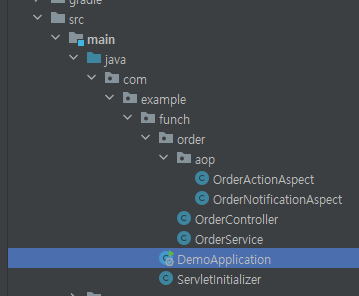

# \[AOP] Spring AOP 정리

## AOP

관점 지향 프로그래밍 (Aspect Oriented Programming)

어떤 로직을 기준으로 "핵심적인 관점"과 "부가적인 관점"으로 나누어 보고 그 관점들을 기준으로 모듈화를 하겠다는 의미이다.


### "핵심적인 관점"과 "부가적인 관점" <a href="#compare-aspect" id="compare-aspect"></a>

핵심적인 관점: 핵심 비즈니스 로직

부가적인 관점: 핵심 비즈니스 로직을 달성하기 위해 필요한 데이터베이스 연결, 로깅 등

> **"부가적인 관점"**의 특징으로 코드 상에서 여러 곳에서 반복해서 사용되는데 이를 흩어진 관심사(Crosscutting Concerns)라고 말하고 이반복되고 있는 <mark style="color:red;">흩어진 관심사를 모듈화하여 재사용</mark>하겠다는 취지이다.


### Spring AOP 주요 개념

<table><thead><tr><th width="137">용어</th><th>설명</th></tr></thead><tbody><tr><td><strong>Aspect</strong></td><td>흩어진 관심사를 모듈화한 것(데이터베이스 연결, 로깅 등)</td></tr><tr><td><strong>Pointcut</strong></td><td>어떤 Join Point에 Advice를 적용할 지 결정하는 방법을 정의</td></tr><tr><td><strong>Advice</strong></td><td>Aspect의 기능을 정의한 것으로 메소드 실행 전, 후, 예외 처리 발생 등 실행 시점을 선언</td></tr><tr><td><strong>Join Point</strong></td><td>Aspect를 적용할 수 있는 프로그램의 특정 지점(메서드 호출, 객체 생성 등)</td></tr></tbody></table>


### 실제로 적용해보면서 이해해보기 <a href="#example" id="example"></a>

#### 의존성 추가 <a href="#example-dependency" id="example-dependency"></a>

```groovy
dependencies {
    // ...
    implementation 'org.springframework:spring-aspects'
    // ...
}
```

#### 예제 프로젝트 구조 <a href="#example-structure" id="example-structure"></a>

<div align="left">

<figure><figcaption></figcaption></figure>

</div>

#### 적용 <a href="#example-apply" id="example-apply"></a>

1. 비즈니스 로직(서비스 레이어드)

```java
package com.example.funch.order;
// import ... 생략
@Service
public class OrderService {
    public String purchase(String userId) {
        // 복잡한 비즈니스 로직
        return puchaseId;
    }
}
```

2. 새로운 요구사항 발생

* 1\) 사용자 구매 행위에 대해 로그 출력
* 2\) 알림 발송

3. AOP 적용

1\) 사용자 구매 행위 로그 출력을 위한 Aspect

```java
package com.example.funch.order.aop;
// import ... 생략
@Component
@Aspect // 부가 관심사 등록
public class OrderActionAspect {
   // Around: Advice 옵션
   // execution: Point Cut 옵션
   @Around("execution(* com.example.funch.order.OrderService.purchase(..))")
   public Object printLog(ProceedingJoinPoint jointPoint) throws Throwable {
      // 사용자 행위에 대한 로그 출력 또는 저장 로직
      return joinPoint.proceed();
   }   
}
```

2\) 사용자 구매 알림 발송 Aspect

```java
package com.example.funch.order.aop;
// import ... 생략
@Component
@Aspect // 부가 관심사 등록
public class OrderNotificationAspect {
    // AfterReturning: Advice 옵션
    // execution: Point Cut 옵션
    @AfterReturning(
         pointcut = "execution(* com.example.funch.order.OrderService.purchase(...))",
         returning = "result"   
    )
    public void send(JoinPoint joinPoint, String result) {
         // 사용자 구매 알림 발송 로직
    }
}
```


간단하게 흐름만 정리했을 때에는 위와 같은 흐름으로 Aspect를 생성한다.
