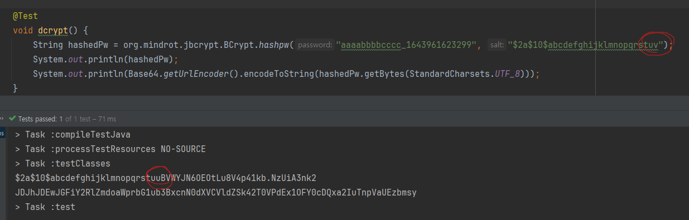
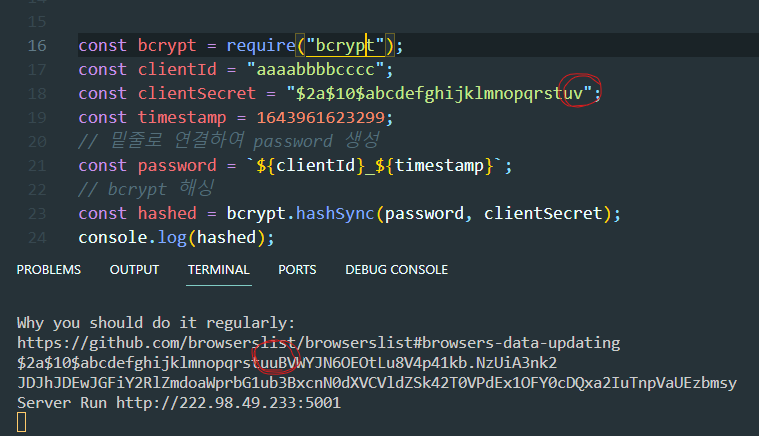
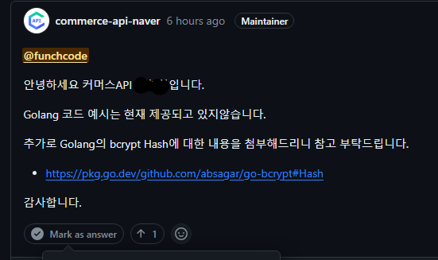

# 24.02.29 Hi James

나는 개발자가 되면서 기대했던 게 있다.

내가 외국어를 할 줄 모르더라도 개발 언어를 통해 외국인과 소통할 수 있다는 것이었는데 돌아보니 4년 넘게 개발 일을 하면서 실제로 그랬던 적은 한 번도 없었다..😅


이번에 진행하고 있는 사이드 프로젝트에 네이버 커머스 API를 연계하여 기능을 사용해야 했다.

사이드 프로젝트는 Go 언어로 진행하고 있는데 네이버 커머스 API에는 Go 샘플 코드는 없었다.


골치 아팠던 대목은 "전자서명 생성"하는 쪽이었는데, `bcrypt` 에 문자열로 된 Salt를 사용하여 해싱한 값을 만들면 됐었다.

사이트에서 제공하는 샘플 코드로 `Java, Python, PHP...`등 해싱한 데이터를 갖고 오는 샘플 코드는 엄청 간단해보였다.

하지만 Go에서 제공하는 bcrypt 기본 라이브러리에서는 문자열 Salt로 해싱할 수 없어서 오픈소스를 찾아봐야 했다.


대안 라이브러리로 두 가지 정도를 찾을 수 있었다.

* github.com/absagar/go-bcrypt
* github.com/jameskeane/bcrypt


`absagar/go-bcrypt` 라이브러리는 **C**를 직접 호출해서 해싱 값을 생성하고 있었다.

배포할 서버, 테스트할 PC에 gcc 컴파일러를 준비해야 한다는 점에서 일단 제외했고 순수 Go로 작성된 `jameskeane/bcrypt` 라이브러리를 사용하기로 했다.

> 라이브러리들을 보면서 좀 놀랐던 것이 마지막 Commit 날짜가 하나는 7년 전 다른 하나는 14년 전...


`jameskeane/bcrypt` 라이브러리로 네이버커머스 API  샘플과 비슷하게 코드를 작성했다.

```go
package main_test

import (
    "encoding/base64"
    "fmt"
    "testing"
    "github.com/jameskeane/bcrypt"
)

func TestBcrypt(t *testing.T) {
    hashed, _ := bcrypt.Hash("aaaabbbbcccc_1643961623299", "$2a$10$abcdefghijklmnopqrstuv")
    fmt.Println(hashed) // $2a$10$abcdefghijklmnopqrstuvBVWYJN6OEOtLu8V4p41kb.NzUiA3nk2
    fmt.Println(base64.StdEncoding.EncodeToString([]byte(hashed))) // JDJhJDEwJGFiY2RlZmdoaWprbG1ub3BxcnN0dXZCVldZSk42T0VPdEx1OFY0cDQxa2IuTnpVaUEzbmsy
}
```

기대 값:  JDJhJDEwJGFiY2RlZmdoaWprbG1ub3BxcnN0dX<mark style="color:red;">V</mark>CVldZSk42T0VPdEx1OFY0cDQxa2IuTnpVaUEzbmsy

실제 값: JDJhJDEwJGFiY2RlZmdoaWprbG1ub3BxcnN0dX<mark style="color:red;">Z</mark>CVldZSk42T0VPdEx1OFY0cDQxa2IuTnpVaUEzbmsy


실제로 기대하는 값과는 _다른 해싱 데이터_가 나왔다. 🤨

처음에는 이 Go 라이브러리에 문제가 없다고 가정하고 커머스 API 샘플 코드를 의심했다.

그래서 Java, Node 환경에서도 코드를 작성하여 실행했다.

<figure><figcaption><p>Java 환경에서 테스트</p></figcaption></figure>

<figure><figcaption><p>Node 환경에서 테스트</p></figcaption></figure>

실제로 실행시켜 보니 커머스 API 샘플코드는 이상이 없다는 것을 확인했다.

그렇다는 것은 Go 라이브러리 자체에 이슈가 있다는 생각을 하게 되었다.

> Go version (1.17 - 1.21), 디버깅... 등 시간을 참 많이 쏟았다.
>
>
>
> 특히 좀 이상했던 점은 Java 환경에서 테스트를 진행할 때 clientSecret 값의 마지막 문자를 아무렇게나 줘도 동일하게 'u'로 나오고 있었다. (이 대목에서 라이브러리 내의 encode, decode를 의심하게 됐다.)\
> \
> 반대로 Go 환경에서 테스트할 때 clientSecret 값을 'u'로 변경해서 해싱을 돌리면 원하는 값이 나왔다.

Java에서 사용한 라이브러리와 jameskeane/bcrypt 라이브러리를 디버깅도 해봤지만 실제로 Bcrypt를 어떻게 해싱하는지를 알아야 이 문제를 풀 수 있겠다는 판단이 섰다.


그래서 먼저 이런 문제에 대해 설명하고 다른 대안이 있는지 커머스 API에 문의했다.

<div align="left">

<figure><figcaption><p>commerce-api-naver github</p></figcaption></figure>

</div>

개발하는 환경, 배포할 환경 마다 gcc를 설치하는 수고를 하고 싶지 않아서 사용해보진 않았다.

~~( 사실 시도는 했지만 unknown type name 'u\_int32\_t' 등 복잡스러워서 빠르게 해결하고 싶어서 미뤘 )~~


이 포스팅을 하게 된 계기, 라이브러리 개발자에게 직접 문의를 했다.

영어를 할 줄 몰라서 파파고를 열심히 돌렸다.

&#x20;`언젠간 꼭 영어 학원에 다니겠다고 또 다짐했다.`

<figure><figcaption></figcaption></figure>

<figure><figcaption></figcaption></figure>

메일을 보냈는데 15분 만에 답장이 왔다.🤩

사실 마지막 커밋 날짜가 14년 전이라서 기대하고 있지 않았었는데 답장이 와서 놀랬고 생각보다 빠르게 응답이 와서 더 놀랬고 캐나다에 사는 James라는 사람과 의미있는 대화를 했다는 것에 감격스러웠다.😭😭


<div align="left">

<figure><figcaption></figcaption></figure>

</div>

James 말로는 hashed 구조는 "\<salt>+\<hashed\_value>"로 단순하다면서 input으로 넘겨준 `$2a$10$abcdefghijklmnopqrstuv`의 값에서 'v'의 값이 'u'로 변경되는 것이 오히려 이해할 수 없다고 말하는 것 같았고 마지막으로 내가 사용하려고 하는 bcrypt는 레거시하니 scrypt를 사용하는 것을 추천해주면서 대화가 끝이났다.


문제의 해법을 찾아낸 것은 아니지만 라이브러리를 개발한 외국인에게 직접 질문하고 답변받고 하는 이 과정이 나에게 대단히 의미가 있고 진한 여운이 남아서 글로 남기게 되었다.
